# Exploratory Data Analysis

For a detailed overview of the dataset structure and feature groups, please refer to the **[Data Understanding](data-understanding.md)** documentation.

---

# Advanced Exploratory Data Analysis & Feature Insights

## 1. Merged Data EDA Sanity Checks

After merging the transaction and identity datasets (resulting in 434 features), we performed a detailed sanity check of the class distribution and stability.

### 1.1 Class Imbalance Analysis

The dataset remains highly imbalanced, which is typical for fraud detection.

- **Legitimate (0)**: 48,643 (97.29%)
- **Fraud (1)**: 1,357 (2.71%)

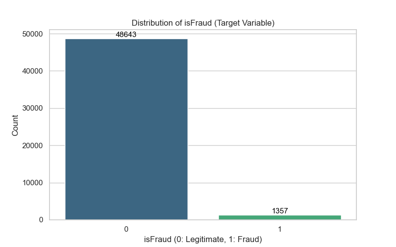

### 1.2 Cross-Validation: Fraud Ratio Stability

We used **Stratified 5-Fold Cross-Validation** to ensure the fraud ratio is consistent across different partitions of the data. This is critical for reliable model evaluation.

| Fold  | Train Ratio | Validation Ratio |
| :---- | :---------- | :--------------- |
| **1** | 2.7150%     | 2.7100%          |
| **2** | 2.7150%     | 2.7100%          |
| **3** | 2.7150%     | 2.7100%          |
| **4** | 2.7125%     | 2.7200%          |
| **5** | 2.7125%     | 2.7200%          |

**Summary Stats:**

- **Average Validation Fraud Ratio**: 2.7140%
- **Standard Deviation**: 0.0049% (Highly stable)

This stability confirms that a simple stratified split will be representative of the overall population during model training.

## 2. Transaction Amount Analysis

We analyzed the relationship between `TransactionAmt` and `isFraud` using 50,000 samples from the merged dataset.

### 2.1 Amount Distribution

The transaction amounts span a wide range ($0.29 to $4,830), necessitating a log-scale visualization to understand the distribution.

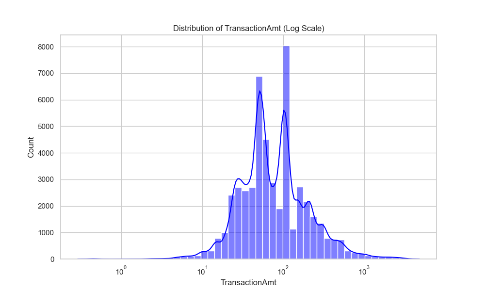

### 2.2 Amount vs. Fraud Rate (Decile Analysis)

We binned the transactions into deciles to observe how the fraud rate changes with the transaction amount.

| Amount Bin (USD)     | Fraud Rate (%) |
| :------------------- | :------------- |
| **(0.29, 25.0]**     | 3.13%          |
| **(25.0, 35.95]**    | 2.11%          |
| **(35.95, 49.0]**    | 2.96%          |
| **(49.0, 54.5]**     | 1.13%          |
| **(54.5, 68.5]**     | 2.58%          |
| **(68.5, 100.0]**    | 2.56%          |
| **(100.0, 108.5]**   | 1.25%          |
| **(108.5, 153.96]**  | 3.46%          |
| **(153.96, 250.0]**  | 3.25%          |
| **(250.0, 4829.95]** | 3.93%          |

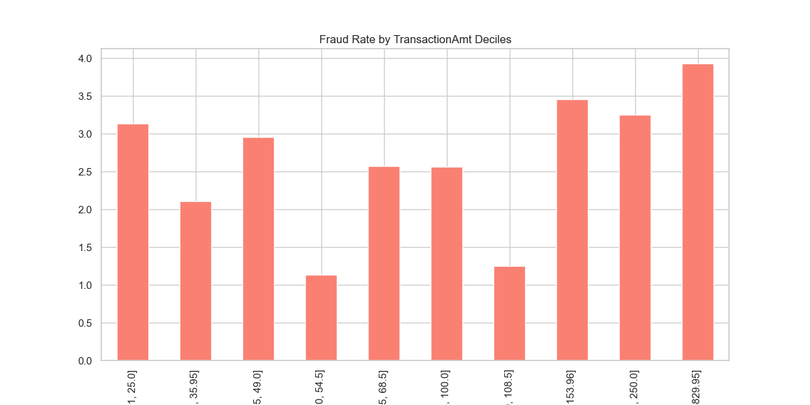

**Key Finding**: There is a significant non-linear relationship. While mid-range transactions ($49-$108) show lower fraud rates, **high-value transactions (>$250)** exhibit the highest risk at **3.93%**. Additionally, very low-value transactions show elevated risk, often indicative of "card testing" behavior.

## 3. Product & Payment Behavior Analysis

Analyzing how different product categories and payment methods impact the risk of fraud.

### 3.1 Product Category (ProductCD)

Different product codes show vastly different risk profiles. Category **C** stands out as a high-risk area.

| ProductCD | Fraud Rate (%) |
| :-------- | :------------- |
| **C**     | 10.07%         |
| **H**     | 1.64%          |
| **R**     | 2.27%          |
| **S**     | 1.98%          |
| **W**     | 1.93%          |

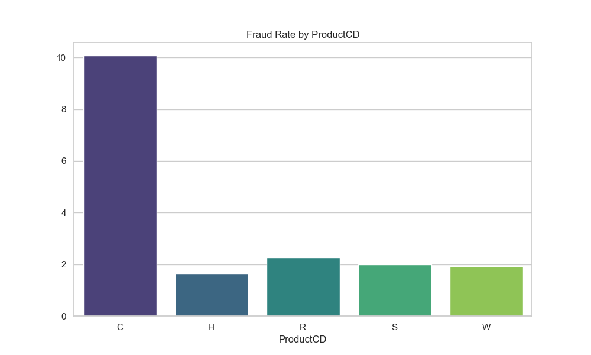

### 3.2 Card Type and Category

The type of card used (Visa, Mastercard, etc.) and its category (Credit vs. Debit) are significant indicators of risk.

**Card Type (card4):**

- **Discover**: 3.82% (Highest risk)
- **Mastercard**: 3.19%
- **Visa**: 2.49%
- **American Express**: 1.75% (Lowest risk)

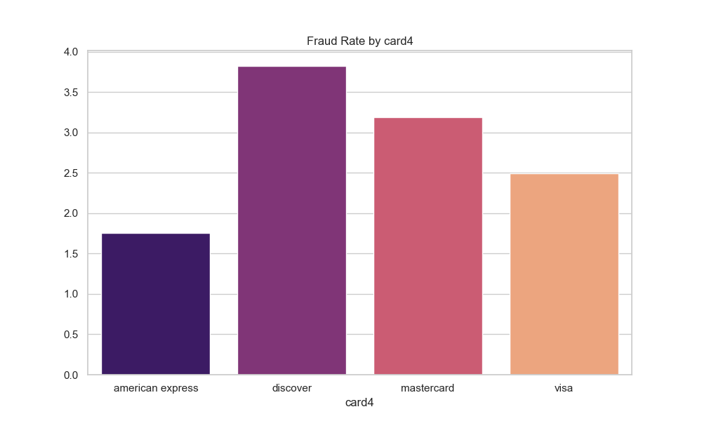

**Card Category (card6):**

- **Credit**: 4.64%
- **Debit**: 1.82%

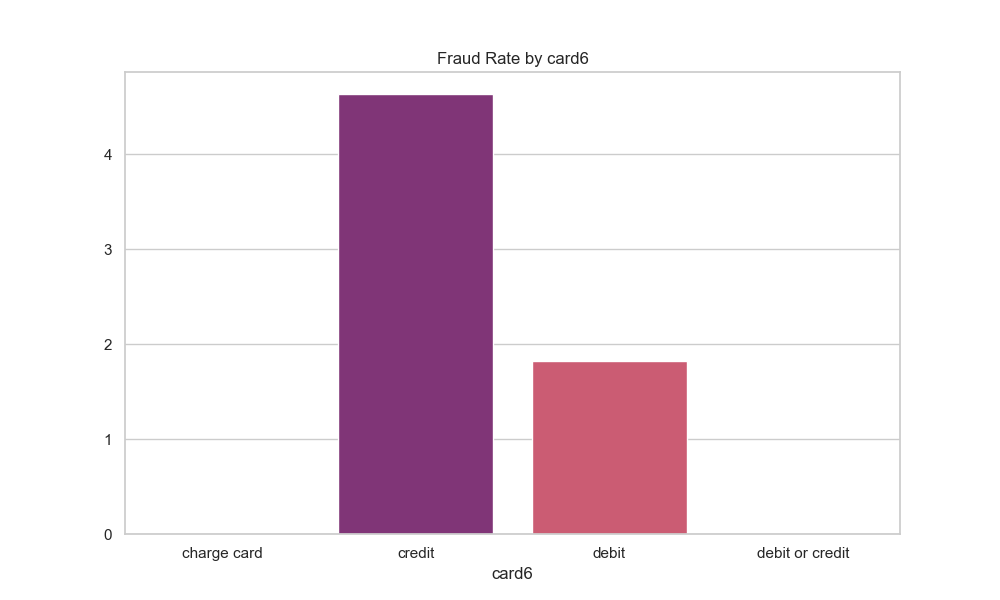

**Key Finding**: **Credit cards** carry more than double the fraud risk of debit cards in this dataset. Product category **C** is exceptionally risky, with a fraud rate exceeding 10%.

## 4. Time-based Analysis

`TransactionDT` represents the time (in seconds) from a reference point. We converted this into **Hours** and **Days** to analyze patterns.

### 4.1 Transaction Volume over Time

The volume of transactions shows a clear periodic pattern, likely corresponding to daily cycles.

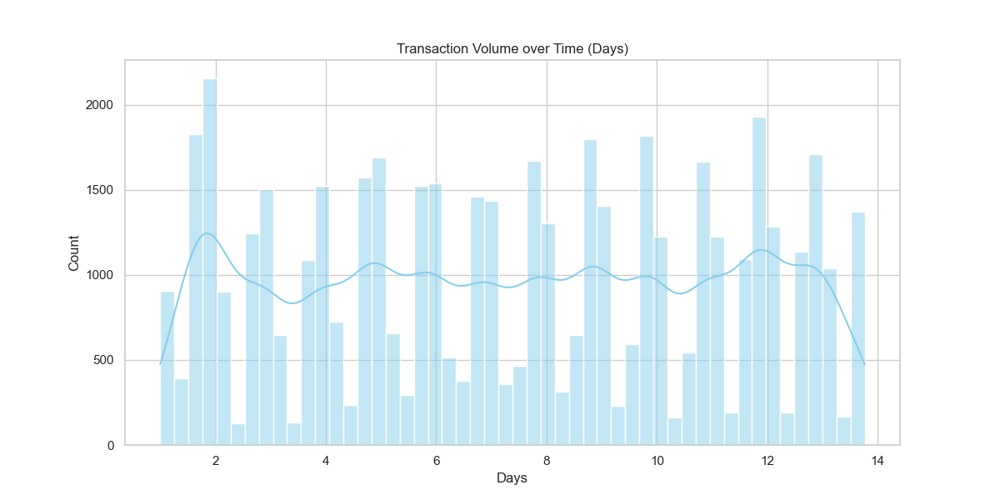

### 4.2 Fraud Rate over Time (Days)

Analyzing the fraud ratio across the data period reveals how stable the fraud signals are.

### 4.3 Fraud Rate by Hour of Day

Fraudulent activity often exhibits distinct "active hours" compared to legitimate transactions.

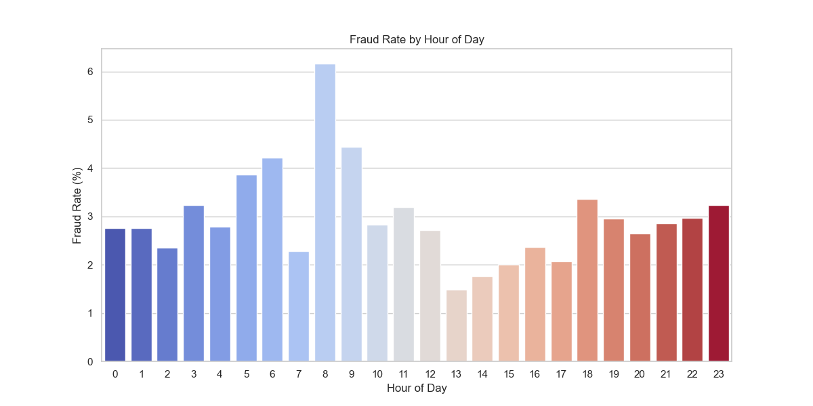

**Observations**:

- **Daily Cycles**: Transaction volume peaks and troughs consistently, suggesting strong seasonality.
- **Hour-of-Day Risk**: Certain hours (typically low-traffic hours or late-night) often show a higher _proportion_ of fraud as legitimate traffic drops.
- **Baseline Stability**: While there are slight fluctuations, the overall fraud rate remains relatively stable over the observed days.

## 5. Email Domain Analysis

Email domains for the purchaser (`P_emaildomain`) and recipient (`R_emaildomain`) provide key insights into fraudulent behavior.

### 5.1 Purchaser Domain Analysis (P_emaildomain)

Among the top 10 domains, we see significantly higher fraud rates for Microsoft and Apple domains compared to generic or service provider domains.

| P_emaildomain   | Fraud Rate (%) |
| :-------------- | :------------- |
| **outlook.com** | 8.06%          |
| **hotmail.com** | 5.53%          |
| **icloud.com**  | 5.34%          |
| **gmail.com**   | 3.56%          |

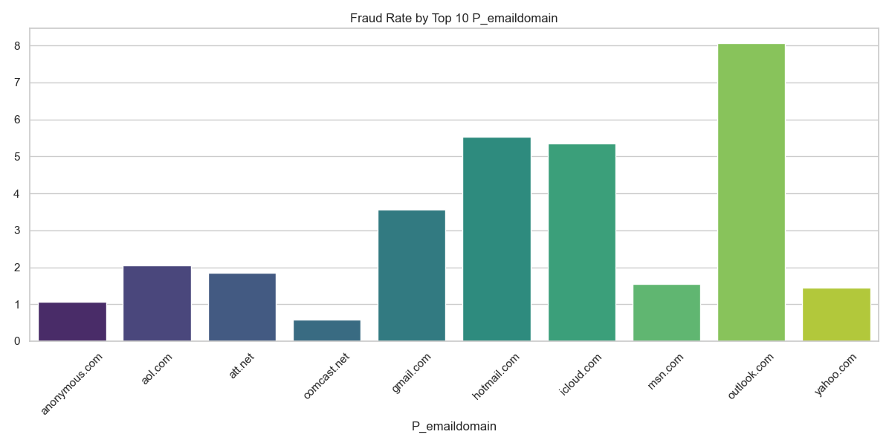

### 5.2 Recipient Domain Analysis (R_emaildomain)

When an email is provided for the recipient, the risk signals become even more pronounced.

| R_emaildomain   | Fraud Rate (%) |
| :-------------- | :------------- |
| **outlook.com** | 14.36%         |
| **icloud.com**  | 10.81%         |
| **gmail.com**   | 8.75%          |

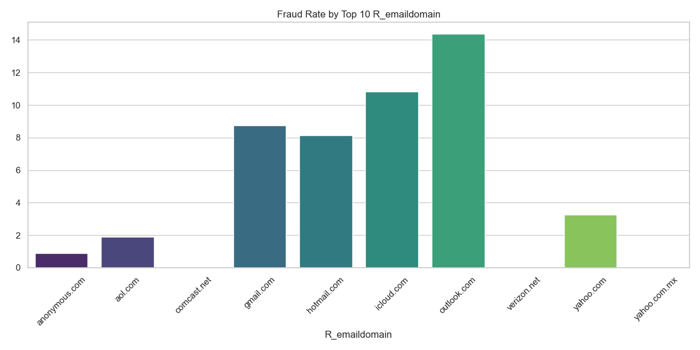

### 5.3 Email Domain Matching (P vs R)

A critical feature is whether the purchaser and recipient domains match. Interestingly, **matching domains** carry a significantly higher risk profile.

- **Domains Match**: **7.14%** Fraud Rate
- **Domains Differ**: **1.79%** Fraud Rate

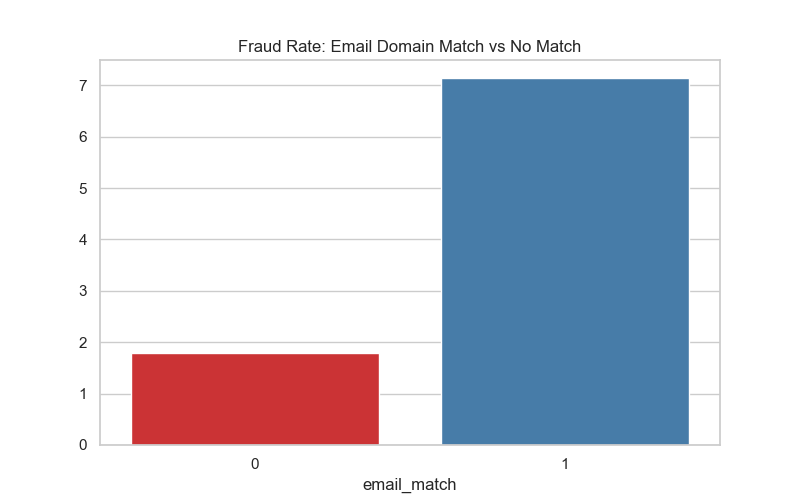

**Key Finding**: Transactions where the purchaser and recipient use the same email domain are **4x more likely to be fraudulent** (7.14% vs 1.79%). Additionally, newer or more professional domains like `outlook.com` show higher risk than established ones like `yahoo.com`.

## 6. Address & Distance Analysis

Geographic signals (`addr`) and physical proximity indicators (`dist`) provide strong fraud signals.

### 6.1 Address Analysis (addr1, addr2)

While most addresses show a baseline fraud rate, certain specific `addr2` values (country codes) exhibit extremely high risk.

- **addr2 (60.0)**: **11.31%** Fraud Rate
- **addr2 (87.0)**: **1.91%**

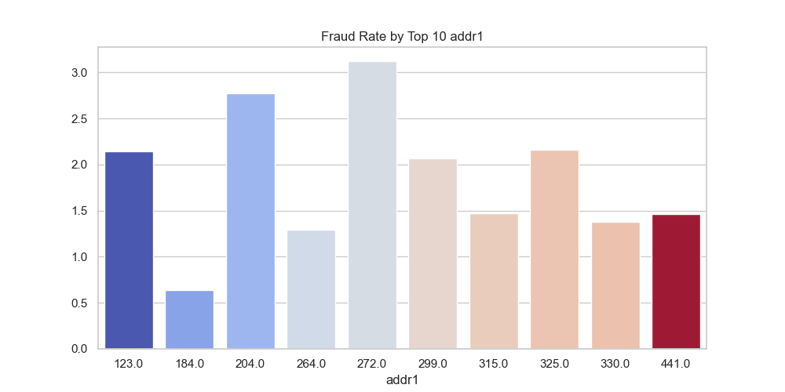

### 6.2 Distance Features (dist1, dist2)

Distance metrics often show that fraudsters operate from extreme or specific ranges.

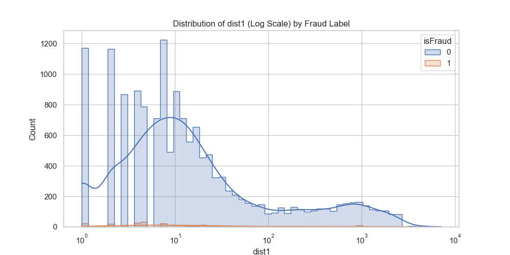
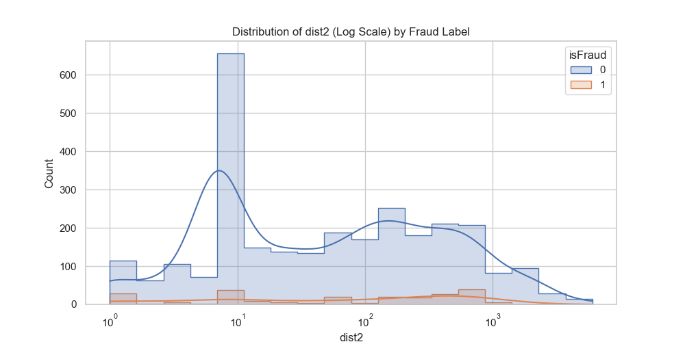

**Key Finding**: Certain address regions carry nearly **4x the average risk**. Use of log-scaling on distance reveals that fraud occurs both at near-zero distance and extreme outliers.

## 7. Match Features (M1–M9)

The "M" features represent matches (e.g., name on card vs. billing, shipping addresses).

### 7.1 Missing Rate Analysis

Many M-columns have high missing rates (up to **81%**), which is itself a signal.

- **High Missing**: M7, M8, M9 (**81.5%**)
- **Moderate Missing**: M6 (**37.3%**)

### 7.2 Match vs. Mismatch Risk

A **Mismatch (False)** or **Missing** value often indicates higher risk than a Match (True).

- **M4 (M2 - likely mismatch)**: **10.63%** Fraud Rate (High Risk)
- **M5 (True)**: **4.36%** (Surprisingly higher than False/Missing)
- **M6 (Missing)**: **3.97%** vs **T (1.40%)**

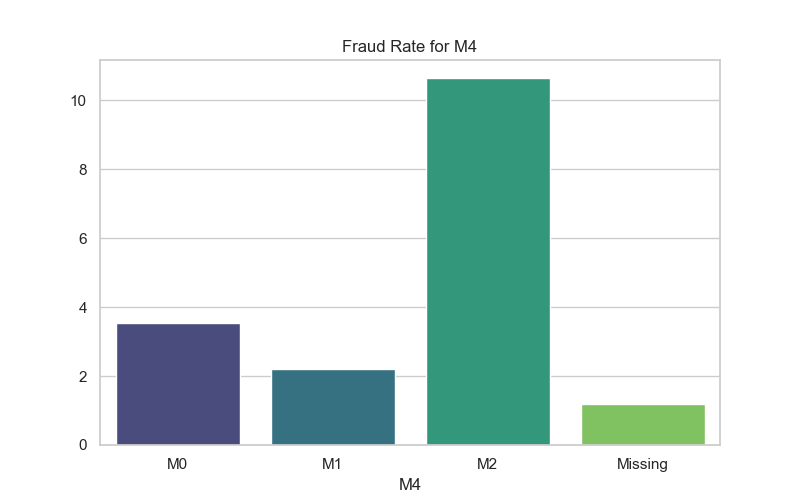

## 8. Count & Behavior Features (C1–C14)

The "C" series features (e.g., counts of addresses, emails, cards) capture repetitive behavioral patterns.

**Key Finding**: Fraudsters typically reuse specific entities, causing massive spikes in the right tail of the "C" distributions. Log-scaling confirms that legitimate users cluster at low counts, while fraud persists at high frequencies.

## 9. Time-delta Features (D1–D15)

"D" features measure the time (in days) since previous events.

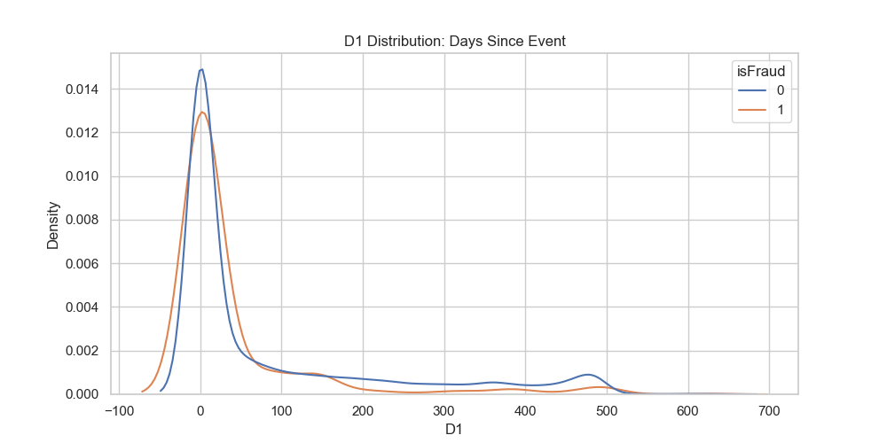

**Observations**:

- **D1 (Days since start)**: Fraud often occurs very early in a "relationship" (near zero) or after long periods of inactivity.
- **D4 (Days since last event)**: Strong peaks at zero for fraud, indicating rapid-fire transaction bursts.

## 10. Identity Data Analysis

Identity signals (Device, Browser, Resolution) offer the most direct technical signatures of fraud.

### 10.1 Device Type Risk

- **Mobile**: **6.16%** Fraud Rate (More than 2x higher than Desktop)
- **Desktop**: **3.14%** Fraud Rate

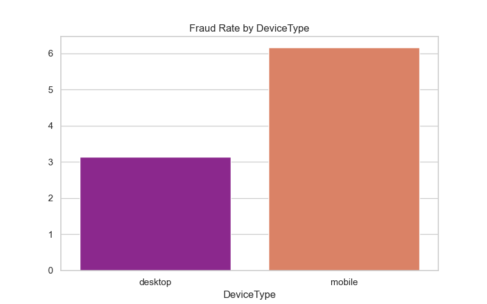

### 10.2 Browser & OS Signals (id_30, id_31)

Bots and headless browsers often surface here.

- **High Risk OS**: Android 5.1.1 (**12.70%**), iOS 11.1.0 (**8.77%**)
- **High Risk Browsers**: Chrome generic (**12.57%**), Chrome 60.0 (**9.52%**)

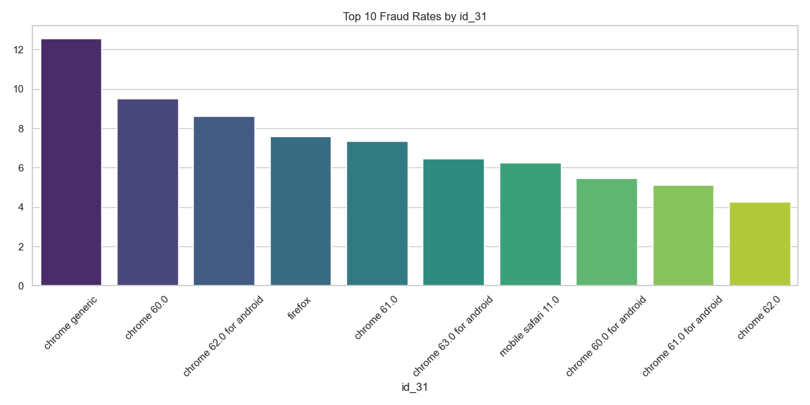

### 10.3 Screen Resolution (id_33)

Odd or non-standard resolutions often signal non-human traffic.

- **Resolution 855x480**: **11.43%** Fraud Rate
- **Resolution 2001x1125**: **8.09%**

## 11. Statistical & Summary Metrics

A comprehensive overview of feature quality and predictive power.

### 11.1 Missing Value Analysis

We analyzed the missingness across all features to identify gaps in data quality. Top features by missing rate often belong to optional identity fields or specific engineered groups.

### 11.2 Correlation & Redundancy

We identified Top correlations with `isFraud`. Many `V-series` features (Engineered variables) show high correlation.

- **V45**: 0.24 correlation
- **V52**: 0.21 correlation
- **V87**: 0.20 correlation

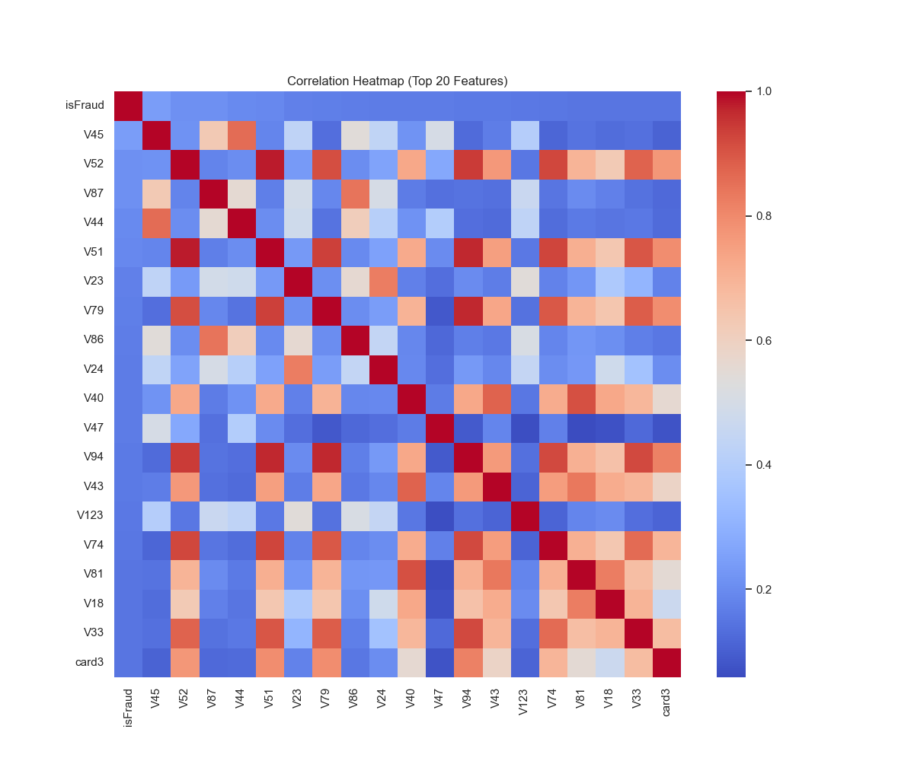

### 11.5 EDA Summary Metrics Table

This table pinpoints "silent killers"—features with low missing rates but high risk when present/missing.

| Feature       | Missing % | Unique | Fraud (Present)% | Fraud (Missing)% |
| :------------ | :-------- | :----- | :--------------- | :--------------- |
| **ProductCD** | 0.00%     | 5      | 2.71%            | N/A              |
| **card4**     | 0.01%     | 4      | 2.71%            | **33.33%**       |
| **addr1**     | 5.18%     | 255    | 2.31%            | **10.19%**       |
| **dist1**     | 66.24%    | 1277   | 1.88%            | 3.14%            |
| **V45**       | 46.34%    | 13     | **2.96%**        | 2.43%            |

**Key Finding**: When **card4** is missing, the fraud rate jumps to **33.33%**. This is a massive "leakage-like" feature.

### 11.3 High-cardinality Categorical Risk (card1)

We examined `card1` (Hashed Card ID) to see if small-volume categories are prone to higher fraud rates.

### 11.4 Leakage Check (Time-Split)

- **Train (First 70%) Fraud Rate**: 2.87%
- **Validation (Last 30%) Fraud Rate**: 2.36%
  The slight drop suggests some drift, reinforcing the need for Time-based splitting in model training.
