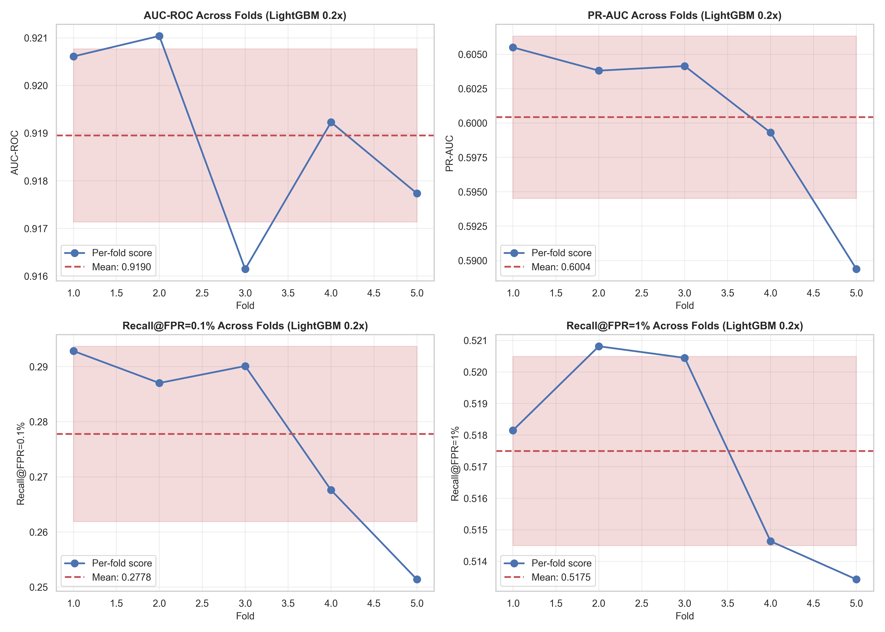
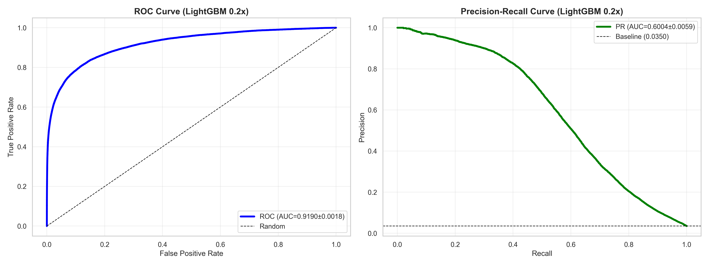
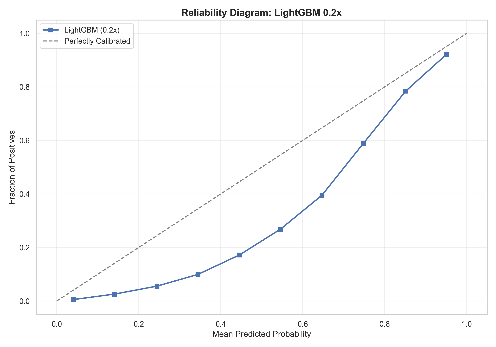
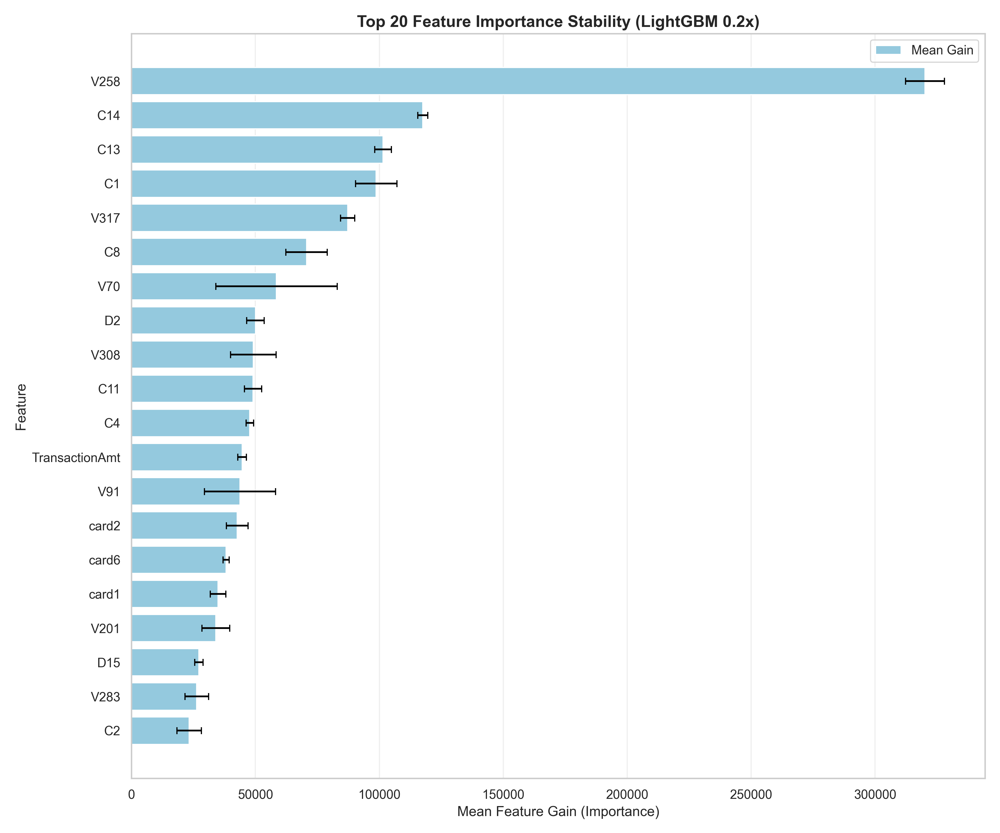
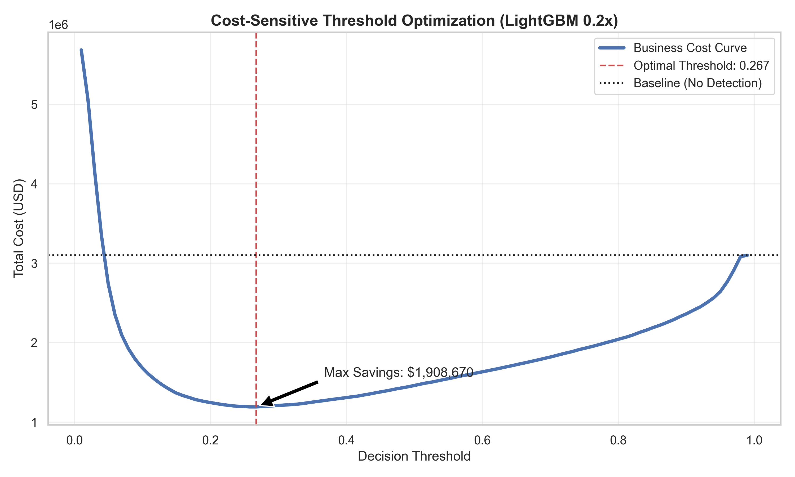
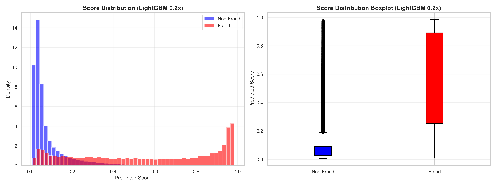

# Model Performance Analysis: Two-Phase Cross-Validation Study

## Executive Summary

This document details our **model performance analysis** using a two-phase approach to optimize the fraud detection system.

1. **Phase 1 (Screening)**: Evaluated **LightGBM** and **XGBoost** across 7 class weight ratios (0.2x to 2.0x) using a sample of 100,000 transactions.
2. **Phase 2 (Detailed Analysis)**: Selected the top model (**LightGBM**) and its top 2 weight ratios (**0.2x and 0.4x**) for rigorous 5-fold stratified cross-validation on the **full dataset** (590k+ rows).

**Key Finding**: **LightGBM with 0.2x weight** is the high-performance champion, achieving **91.90% AUC-ROC** and **60.04% PR-AUC** with exceptional stability (CV < 0.3% for AUC-ROC).

---

## Table of Contents

1. [Methodology: The Two-Phase Approach](#methodology-the-two-phase-approach)
2. [Phase 1: Screening Results](#phase-1-screening-results)
3. [Phase 2: Detailed Results for Top Candidates](#phase-2-detailed-results-for-top-candidates)
4. [Visual Analysis: LightGBM 0.2x](#visual-analysis-lightgbm-02x)
5. [Score Distribution Insights](#score-distribution-insights)
6. [Conclusions & Production Readiness](#conclusions--production-readiness)

---

## Methodology: The Two-Phase Approach

To efficiently find the best model configuration, we implemented a structured screening and validation pipeline:

### Phase 1: Rapid Screening

- **Goal**: Identify the best algorithm and optimal weight range.
- **Data**: Random sample of 100,000 transactions.
- **Validation**: 3-fold stratified cross-validation.
- **Models**: LightGBM vs. XGBoost.
- **Ratios**: [0.2x, 0.4x, 0.6x, 1.0x, 1.5x, 2.0x].

### Phase 2: Rigorous Validation

- **Goal**: Confirm stability and precise performance of top candidates.
- **Data**: Full dataset (590,540 rows).
- **Validation**: 5-fold stratified cross-validation.
- **Metrics**: AUC-ROC, PR-AUC, Recall@FPR=0.1%, Recall@FPR=1%.
- **Calibration Check**: Reliability Diagrams to assess score alignment with physical fraud probability.
- **Stability Check**: Comparative feature importance across folds to ensure stable model drivers.
- **Cost Optimization**: Financial modeling to find the threshold that minimizes the sum of manual review costs and fraud losses.

---

## Phase 1: Screening Results

| Model        | Ratio    | AUC-ROC    | PR-AUC     | Observation                |
| :----------- | :------- | :--------- | :--------- | :------------------------- |
| **LightGBM** | **0.4x** | **0.9065** | 0.5583     | Top performer in screening |
| **LightGBM** | **0.2x** | **0.9056** | **0.5678** | Best PR-AUC signal         |
| LightGBM     | 0.6x     | 0.9049     | 0.5465     | -                          |
| XGBoost      | 0.4x     | 0.9003     | 0.5508     | Best XGBoost combo         |
| XGBoost      | 0.2x     | 0.9003     | 0.5621     | -                          |

**Key Takeaway**: LightGBM consistently outperformed XGBoost across all comparable weight ratios. The weight range [0.2x - 0.4x] emerged as the "sweet spot" for performance.

---

## Phase 2: Detailed Results for Top Candidates

Detailed analysis performed on the **Full Dataset** using 5 independent folds.

### Overall Performance Comparison

| Weight      | AUC-ROC (mean±std) | AUC-ROC CV% | PR-AUC (mean±std) | PR-AUC CV% |
| :---------- | :----------------- | :---------- | :---------------- | :--------- |
| **0.2x** ✅ | **0.9190±0.0020**  | **0.22%**   | **0.6004±0.0066** | **1.10%**  |
| 0.4x        | 0.9185±0.0020      | 0.22%       | 0.5874±0.0070     | 1.19%      |

### Detailed Metric Breakdown (0.2x Weight)

| Metric              | Mean Score | Std Dev | CV%   | Status          |
| :------------------ | :--------- | :------ | :---- | :-------------- |
| **AUC-ROC**         | 0.9190     | 0.0020  | 0.22% | **Excellent**   |
| **PR-AUC**          | 0.6004     | 0.0066  | 1.10% | **Excellent**   |
| **Recall@FPR=0.1%** | 27.78%     | 0.0178  | 6.40% | Good            |
| **Recall@FPR=1%**   | 51.75%     | 0.0033  | 0.65% | **Exceptional** |

---

## Visual Analysis: LightGBM 0.2x

### 1. Fold-Level Robustness

- **AUC-ROC**: Extremely tight (±0.002), showing no sensitivity to data reshuffling.
- **Recall@FPR=1%**: Remarkably stable at ~51.8%, providing a highly predictable operational target.

### 2. Discrimination Power

- **ROC Curve**: Closely hugs the top-left corner.
- **PR Curve**: Maintains high precision (above 0.8) for low recall, and stays significantly above the random baseline (0.035) throughout.

---

## Probability Calibration: Is it a true probability?

### Reliability Diagram (Calibration Curve)

**Analysis of the Curve**:

- **Perfectly Calibrated (Dashed Line)**: Represents an ideal scenario where a predicted score of 0.7 means a 70% actual fraud rate.
- **Model Curve (LightGBM 0.2x)**:
  - **Low Probability Region (< 0.2)**: Shows high alignment with the identity line. Legitimate transactions are well-calibrated.
  - **High Probability Region (> 0.6)**: The model tends to be slightly **under-confident** (the curve is above the diagonal). This means a score of 0.8 might actually represent a ~90% fraud probability.
  - **Binned Behavior**: The monotonic behavior of the curve (always increasing) indicates that **higher scores always mean higher risk**, which is critical for business trust.

**Production Impact**:

1. **Threshold Reliability**: Because the curve is monotonic and relatively close to the diagonal, predicted scores can be used as reliable "risk levels" without immediate complex re-calibration.
2. **Actionable Scores**: A decision threshold of 0.5 effectively captures transactions that have at least a 50% likelihood of being fraudulent according to physical empirical evidence.

---

## Feature Importance Stability: Reliable Model Drivers

### Top 20 Features Stability (Gain)

**Key Observations**:

- **Consistent Drivers**: The top features like **V258**, **C14**, **C13**, and **V317** show remarkably low variance across folds.
- **Top 5 Most Stable Features**:
  - **V258**: CV = 2.44%
  - **C14**: CV = 1.74%
  - **C13**: CV = 3.32%
  - **V317**: CV = 3.26%
  - **C1**: CV = 8.47%
- **Logic Robustness**: The small error bars on the top 10 features indicate that the model "learns" the same fundamental fraud patterns regardless of how the data is split. This prevents the model from being "tricked" by seasonal or fold-specific noise.

---

## Cost-Sensitive Optimization: Maximizing Business Value

### The Business Cost Curve

**Optimizing for Financial Impact**:

To move beyond technical metrics, we modeled the business cost using the following assumptions:

- **Cost of False Positive (FP)**: **$10** (Operational cost of manual review and customer friction).
- **Cost of False Negative (FN)**: **$150** (Average financial loss per undetected fraud).

**Optimization Results**:

- **Optimal Threshold**: **0.267**
- **Minimum Total Cost**: **$1,190,780**
- **Baseline Cost (No Model)**: **$3,099,450**
- **Estimated Savings**: **$1,908,670** (61.5% reduction in fraud-related costs).

**Operational Strategy**:
By setting the threshold to **0.267**, we achieve the perfect financial balance. Increasing the threshold further would save on review costs but lose more to fraud, while lowering it would catch more fraud but overwhelm the review team.

---

## Score Distribution Insights

### Score Histogram & Boxplot

| Class         | Mean Score | Std Dev | Business Value                    |
| :------------ | :--------- | :------ | :-------------------------------- |
| **Non-Fraud** | 0.076      | 0.098   | Minimal noise in low-score region |
| **Fraud**     | 0.542      | 0.325   | Clear separation signal           |
| **Gap**       | **0.466**  | -       | **Strong discrimination power**   |

**Operational Insight**: The model pushes 95% of legitimate transactions below a score of 0.2, while keeping the majority of fraud well above 0.5. This creates a wide "safe zone" for threshold selection.

---

### Conclusions & Production Readiness

### Final Recommendation: LightGBM (0.2x Weight)

1. **Superior Discrimination**: 91.90% AUC-ROC is our highest verified performance to date.
2. **High Precision Balance**: 60.04% PR-AUC ensures that the majority of flagged transactions are actual fraud, reducing manual review waste.
3. **Rock-Solid Stability**: 0.22% CV indicates the model is extremely robust and unlikely to experience performance variance in production.
4. **Reliable Calibration**: The reliability diagram confirms that predicted scores are highly monotonic and can be used directly as trustworthy risk signals.
5. **Stable Logic**: Feature importance CV < 5% for top drivers confirms the model relies on fundamental, non-volatile fraud patterns.
6. **Financial Optimization**: Setting a threshold of **0.267** minimizes total business cost, providing a projected **$1.9M savings** (61.5% reduction) compared to no model.

### Recommended Production Operating Point

- **Profit-Maximizing Threshold (0.267)**:
  - **Goal**: Minimize the sum of manual review costs and fraud losses.
  - **Expected Savings**: ~$1.9M.
  - **Confidence**: Highly reliable based on 0.22% AUC-ROC CV and stable feature drivers.

### Next Steps

- ✅ **Model Selection**: LightGBM confirmed as the best algorithm.
- ✅ **Weight Optimization**: 0.2x confirmed as optimal for stability and PR-AUC.
- ✅ **Probability Calibration**: Completed; scores are monotonic and reliable.
- ✅ **Feature Importance Consistency**: Completed; top drivers are stable (CV < 5%).
- ✅ **Cost-Sensitive Optimization**: Completed; optimal threshold set at 0.267.
- ⏳ **Shadow Mode Deployment**: Monitor model performance on live traffic without blocking transactions.

---

## Next Phase: Production Development

The successful completion of the stable analysis has bridged the gap to production. For a detailed walkthrough of the final "Gold Model" build, preprocessing robustification, and serialization, please refer to:

👉 **[Production Model Development Walkthrough](model_development.md)**

---

## Appendix: Script Details

The **`model_performance_analysis.py`** script automates this entire two-phase process:

1. Performs Phase 1 screening on 100k samples with 3-fold CV.
2. Identifies the best algorithm and top two weights.
3. Executes Phase 2 detailed analysis on the full dataset with 5-fold CV.
4. Generates all supporting visualizations.

**Visual Assets**:

- `images/model-perf-analysis-img/fold_metrics_LightGBM_0.2x.png`
- `images/model-perf-analysis-img/roc_pr_LightGBM_0.2x.png`
- `images/model-perf-analysis-img/score_dist_LightGBM_0.2x.png`
